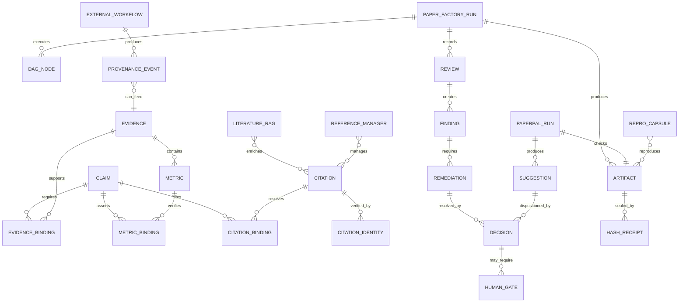
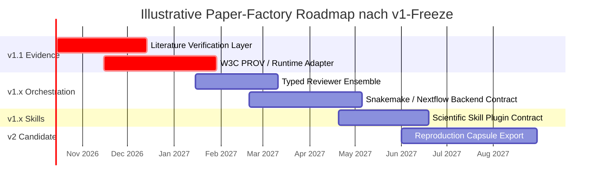

# Deep Research: GitHub-Landschaft für Research Audit, Reproduzierbarkeit und Scientific Automation im Vergleich zu Paper Factory

## Executive Summary

Die Recherche zeigt ein klares Muster: **Es gibt mehrere sehr starke öffentliche GitHub-Projekte für einzelne Teile des Problems, aber in der untersuchten Stichprobe kein öffentliches Repository, das dieselbe Ende-zu-Ende-Kombination wie Paper Factory abdeckt.** Besonders stark sind PaperQA2 bei literaturbasierter Evidenzsuche, `showyourwork!` bei reproduzierbaren Papers, Manubot bei programmatischer Zitations-/Manuskript-Infrastruktur, Flowcept bei Runtime-Provenienz, Snakemake/Nextflow/ReproZip bei reproduzierbarer Ausführung und AI Scientist bzw. AI-Peer-Review bei agentischer Forschung und Review. citeturn8search1turn8search0turn8search2turn9search1

Paper Factory ist nach dem in dieser Konversation dokumentierten Freeze dagegen als **Audit- und Release-Control-System** ungewöhnlich breit: P00–P37-DAG, explizite Claim↔Evidence- und Claim↔Metric-Bindung, Multi-Source-Metrik-Discovery, DOI/arXiv/authoritative-URL-Identity-Checks, Remediation-Closure, persistente Decisions, duale adversariale Reviewer, exact-artifact SHA-Binding, Word/Paperpal-Automation, Human Gates und Release Closure U1–U16. Die von dir bereitgestellte Projektbaseline endet bei rund **574 PASS + 2 Environment-Skips**, P21–P36 PASS, U1–U16 = 16/16, P37 bewusst `NOT_RUN` und abgeschlossenem v1-Freeze. Diese Paper-Factory-Angaben sind **User-/Projektangaben aus unserem Entwicklungsverlauf**, nicht extern von GitHub verifiziert.

Die nächste Entwicklung sollte deshalb **nicht** darin bestehen, Paper Factory durch einen existierenden Konkurrenten zu ersetzen. Sinnvoll ist vielmehr, einige ausgereifte Komponentenmodelle zu übernehmen oder über Adapter nachzubauen:

1. **PaperQA2/Manubot/DeltaSci/sciwrite-lint als Inspiration für einen stärkeren Literature Verification Layer**: Volltext-Evidence, Retraction-Status, bibliographische Normalisierung und Claim-support-Prüfung.
2. **Flowcept-artige Runtime Provenance nach W3C PROV**: Inputs, Outputs, Runtime, Git, Hardware und Agent-Aufrufe maschinenlesbar an Evidenz binden. Flowcept bietet dafür bereits MLflow-, Dask-, TensorBoard- und MCP-orientierte Provenienzmodelle. citeturn8search2
3. **ReproZip/Snakemake/Nextflow als Execution-Capsule-Layer**: Die Paper Factory sollte Forschungsartefakte nicht nur auditieren, sondern optional ihre Reproduktionsumgebung standardisiert kapseln können. citeturn9search1
4. **Multi-Reviewer-Meta-Review nach dem Muster neuer Peer-Review-Projekte**, allerdings unter Beibehaltung der wesentlich strengeren fail-closed Closure-Semantik von Paper Factory.
5. **Ein Plugin-/Skill-Contract für domänenspezifische Auditmodule**, inspiriert von den 2026 stark gewachsenen Scientific-Skills-Repositories von Google DeepMind und K-Dense. fileciteturn36file0L1-L2 fileciteturn37file0L1-L2

Die strategische Positionierung wäre daher nicht „noch ein AI Scientist“, sondern:

> **Paper Factory = evidence-first scientific release assurance: eine kontrollierte Pipeline, die wissenschaftliche Aussagen, Evidenz, numerische Ergebnisse, Zitationen, Reviewer-Entscheidungen und finale Release-Artefakte in einer auditierbaren Closure-Kette zusammenführt.**

Das ist deutlich differenzierter als klassische Deep-Research-Agenten und auch anders als reine Reproduzierbarkeits-Workflow-Engines.

## Methodik und Bewertungsrahmen

Untersucht wurden ausschließlich **öffentliche GitHub-Repositories**. Die GitHub-API wurde für Public/Private-Status, Stars, Forks, Sprache, Lizenz und Aktivitätsdaten herangezogen; README-/Dokumentationsinformationen wurden gegen offizielle Repository-Seiten abgeglichen. Die Auswahl gewichtet nicht nur Popularität, sondern auch semantische Nähe zu Paper Factory. Alle unten aufgenommenen Repositories sind öffentlich; private Repositories wurden nicht einbezogen. Beispielsweise melden PaperQA2, `showyourwork!`, Manubot, Flowcept, ReproZip, Snakemake, AI Scientist, STORM, GPT Researcher und Zotero jeweils `private:false`. fileciteturn42file0L1-L2 fileciteturn5file0L1-L2 fileciteturn6file0L1-L2 fileciteturn9file0L1-L2

Der **Relevanz-Score 0–10** ist meine analytische Bewertung speziell relativ zu Paper Factory. Berücksichtigt wurden: Research-/Paper-Nähe, Evidenzbezug, Provenienz, Reproduzierbarkeit, Zitationsprüfung, automatisierte Review-Mechanismen, Release-/Artifact-Control, technische Reife sowie Integrationswert. Er ist **kein GitHub-Ranking**.

Bei „letzter Commit/Aktivität“ ist eine kleine methodische Einschränkung wichtig: Für einige Repositories konnte der jüngste Default-Branch-Commit direkt ermittelt werden; bei anderen ist der belastbarste verfügbare GitHub-API-Wert `pushed_at`. Deshalb markiere ich die Spalte als **Commit/Push** und behandle sie primär als Recency-Indikator. Stars/Forks sind Momentaufnahmen vom Recherchezeitpunkt **4. Oktober 2026** und verändern sich laufend.

Inhaltlich trenne ich drei Klassen:

- **Evidence-/paper-centric**: PaperQA2, Manubot, STORM, AI Peer Review.
- **Reproducibility-/provenance-centric**: `showyourwork!`, Snakemake, Nextflow, ReproZip, Flowcept.
- **Scientific-agent-centric**: AI Scientist, GPT Researcher und die jüngeren AI4Science-Agenten.

Paper Factory liegt genau **zwischen diesen drei Klassen**. Das ist für die Konkurrenzanalyse entscheidender als ein reiner Star-Vergleich.

## Führende öffentliche Repositories

### Top-Auswahl

| Repository | Stars / Forks | Letzte Aktivität | Sprache | Kurzbeschreibung / Kernfeatures | Reife | Lizenz | Auffällige Integrationen | PF-Relevanz |
|---|---:|---|---|---|---|---|---|---:|
| **[Future-House/paper-qa](https://github.com/Future-House/paper-qa)** | **9,296 / 929** | 2026-09 | Python | PaperQA2: wissenschaftliches RAG über PDF, Text, Office und Code; Evidence Gathering, LLM-Reranking, grounded answers mit Inline-Citations, Metadata Enrichment und Contradiction-Modus. fileciteturn42file0L1-L2 citeturn8search1 | Reifes Research-/Production-Paket | Apache-2.0 | LiteLLM; Crossref; Semantic Scholar; OpenAlex; lokale Volltextindizes | **9.4** |
| **[showyourwork/showyourwork](https://github.com/showyourwork/showyourwork)** | **664 / 61** | 2026-09-29 | TeX | Automatisiert den Workflow eines reproduzierbaren wissenschaftlichen Artikels als selbstenthaltendes, erneut ausführbares Rezept; CLI, Projektlayout, Konfiguration, LaTeX-Integration. fileciteturn5file0L1-L2 citeturn8search0 | Reifes Academic Tool; README nennt es weiter WIP | MIT | LaTeX, CI, reproduzierbare Build-Pipeline | **9.0** |
| **[ORNL/flowcept](https://github.com/ORNL/flowcept)** | **38 / 20** | 2026-08 | Python | Runtime-Provenienz für wissenschaftliche/AI-Workflows über Edge, Cloud und HPC; erfasst Inputs, Outputs, Telemetrie und Workflow-Struktur. fileciteturn9file0L1-L2 citeturn8search2 | Aktive Research Software | MIT | **W3C PROV**, MLflow, Dask, TensorBoard, PyTorch, MCP, MongoDB/LMDB, Redis/Kafka | **8.8** |
| **[manubot/manubot](https://github.com/manubot/manubot)** | **475 / 47** | 2026-08-02 | Python | „Manuscripts, open and automated“: programmatische wissenschaftliche Manuskripte, Metadatenauflösung und Citation Processing. fileciteturn6file0L1-L2 | Reife akademische Infrastruktur | BSD-2-Clause Plus Patent laut `LICENSE.md` fileciteturn31file0L2-L13 | DOI-/arXiv-Metadaten; CSL; Unpaywall; Pandoc-orientierte Workflows fileciteturn31file2L37-L43 fileciteturn31file3L55-L63 | **8.6** |
| **[SakanaAI/AI-Scientist](https://github.com/SakanaAI/AI-Scientist)** | **14,654 / 2,058** | 2025-12-19 | Jupyter Notebook | Automatisiert einen großen Teil des wissenschaftlichen Zyklus – Ideen, Experimente, Paper-Erzeugung und Review – und ist damit ein wichtiger Referenzpunkt für autonome Science-Agenten. fileciteturn10file0L1-L2 | Fortgeschrittener Research-Prototyp | Eigene „AI Scientist Source Code License“; seit Dez. 2025 u. a. Disclosure-Anforderung für maschinell erzeugte wissenschaftliche Manuskripte. fileciteturn30file0L1-L10 | LLM-basierte Experimente und Paper-Generation | **8.3** |
| **[poldrack/ai-peer-review](https://github.com/poldrack/ai-peer-review)** | **154 / 25** | 2026-07 | Python | AI-assistiertes Meta-Review wissenschaftlicher Papers; relevant als Designreferenz für Reviewer-Ensembles und Review-Aggregation. fileciteturn35file0L1-L2 | Akademischer Prototyp | MIT | AI-/LLM-gestütztes Peer-/Meta-Review | **8.2** |
| **[VIDA-NYU/reprozip](https://github.com/VIDA-NYU/reprozip)** | **363 / 37** | 2026-02 | Python | Erfasst die Abhängigkeiten einer ausgeführten wissenschaftlichen Command-Line-Analyse und verpackt sie für spätere Reproduktion. fileciteturn7file0L1-L2 | Reife Repro-Infrastruktur | BSD-3-Clause | ptrace, Docker, Vagrant/ReproUnzip | **8.0** |
| **[snakemake/snakemake](https://github.com/snakemake/snakemake)** | **2,881 / 661** | 2026-10 | Python | Etabliertes Workflow-Management für reproduzierbare wissenschaftliche Pipelines mit explizitem DAG und skalierbarer Ausführung. fileciteturn8file0L1-L2 | **Production** | MIT | Containers, Conda/HPC/Cloud-Workflows | **7.8** |
| **[nextflow-io/nextflow](https://github.com/nextflow-io/nextflow)** | **3,496 / 814** | 2026-10-04 | Groovy | Portable, skalierbare und reproduzierbare Dataflow-Pipelines; unterstützt lokale Systeme, HPC, Clouds und mehrere Environment-/Container-Mechanismen. fileciteturn41file0L1-L2 citeturn9search1 | **Production** | Apache-2.0 | Conda, Spack, Docker, Podman, Singularity, AWS/Azure/GCP/Kubernetes | **7.5** |
| **[stanford-oval/storm](https://github.com/stanford-oval/storm)** | **31,566 / 2,974** | 2025-09-30 | Python | Stanford-System zur LLM-basierten Knowledge Curation: recherchiert Themen und erzeugt lange Reports mit Quellenangaben. fileciteturn11file0L1-L2 | Reifes Research-System | MIT | Web Retrieval, LLM-basierte Knowledge Curation | **7.4** |
| **[assafelovic/gpt-researcher](https://github.com/assafelovic/gpt-researcher)** | **29,903 / 4,081** | 2026-10 | Python | Autonomer Deep-Research-Agent über unterschiedliche Daten und LLM-Provider; Fokus auf Recherche und zitierte Reports. fileciteturn17file0L1-L2 | Reifes OSS-Agent-System | Apache-2.0 | Multi-LLM; MCP laut Repository-Topics; Web-/Dokumentenrecherche | **7.2** |
| **[zotero/zotero](https://github.com/zotero/zotero)** | **15,460 / 1,138** | 2026-10 | JavaScript | Kein Audit-Engine-Konkurrent, aber die wichtigste Referenzplattform in dieser Auswahl für Sammlung, Organisation, Annotation und Zitieren wissenschaftlicher Quellen. fileciteturn18file0L1-L2 | **Production** | AGPLv3 fileciteturn19file0L1-L2 | Bibliotheken, Citation Management, Annotation | **6.8** |

Die bloßen Star-Zahlen dürfen hier nicht fehlinterpretiert werden. STORM und GPT Researcher sind um Größenordnungen populärer als Flowcept, aber **Flowcept ist architektonisch für Paper Factory wesentlich interessanter**, weil PF bereits selbst Research-Orchestration besitzt und stattdessen von besserer Provenienz profitieren würde. Flowcept modelliert Workflow-Provenienz, Telemetrie, Inputs/Outputs und versionierte Artefakte und richtet sich inzwischen auch explizit an agentische Workflows und MCP. citeturn8search2

Ähnliches gilt für PaperQA2: Es ist kein Paper-Release-Auditor, aber sein Evidence-Retrieval-Layer ist technisch sehr relevant. Das Projekt indexiert wissenschaftliche Volltexte, holt Metadaten redundant aus mehreren Quellen, berücksichtigt u. a. Citation Count und Retraction Checks, sammelt und scored Evidenzpassagen und unterstützt LiteLLM-basierte Modelle. citeturn8search1

### Neue Projekte der letzten zwölf Monate

Besonders interessant ist, dass **2026 eine neue Generation explizit evidence-/audit-orientierter Tools auftaucht**. Diese haben häufig noch wenige Stars, sind konzeptionell aber näher an Paper Factory als die bekannten Workflow-Engines.

| Neues Repository | Erstellt | Stand bei Recherche | Warum beobachten? |
|---|---:|---:|---|
| **[K-Dense-AI/scientific-agent-skills](https://github.com/K-Dense-AI/scientific-agent-skills)** | 2025-10-19 | **47,533★ / 4,296 Forks** | Sehr schnell gewachsene modulare Science-Skill-Bibliothek; 177 deklarierte Skills und 100+ Datenbank-/Tool-Anbindungen, kompatibel mit mehreren Coding-/Agent-Umgebungen. Gute Blaupause für PF Domain Skill Packs. fileciteturn37file0L1-L2 |
| **[sistm/AI4Reproducibility](https://github.com/sistm/AI4Reproducibility)** | 2026-03-06 | 1★ | **Direkt konzeptionell relevant:** Repository beschreibt sich als automatisierte Pipeline für Paper Review und Reproducibility Evaluation. Trotz geringer Adoption ein wichtiger Watchlist-Kandidat. fileciteturn14file0L1-L2 |
| **[authentic-research-partners/sciwrite-lint](https://github.com/authentic-research-partners/sciwrite-lint)** | 2026-03-31 | 27★ / 4 Forks | Scientific-manuscript linter; besonders interessant als komplementäre statische Audit-Schicht. fileciteturn15file0L1-L2 |
| **[google-deepmind/science-skills](https://github.com/google-deepmind/science-skills)** | 2026-05-13 | **3,195★ / 359 Forks** | Google-DeepMind-Skills für agentische Forschung mit AlphaGenome, AFDB, UniProt und 30+ Tools/Datenbanken; starkes Vorbild für typed scientific adapters. fileciteturn36file0L1-L2 |
| **[mims-harvard/AutoScientists](https://github.com/mims-harvard/AutoScientists)** | 2026-05-21 | **763★ / 124 Forks** | Self-organizing Agent Teams für lange wissenschaftliche Experimentserien; interessant für PFs Multi-Agent-/adversariale Roadmap. fileciteturn38file0L1-L2 |
| **[boheling/deltasci](https://github.com/boheling/deltasci)** | 2026-05-24 | **143★ / 23 Forks** | Bezeichnet sich explizit als „verification layer for scientific work“; sehr hohe konzeptionelle Nähe zu PFs Citation-/Evidence-Lane. fileciteturn32file0L1-L2 |
| **[aberaio/sourcecheck](https://github.com/aberaio/sourcecheck)** | 2026-07-01 | 1★ | Provenance-first-Verification: überprüft, ob eine wissenschaftliche Quelle einen Claim tatsächlich unterstützt und soll abstain, wenn sie es nicht bestätigen kann. Diese Fail-closed-Philosophie passt sehr gut zu PF. fileciteturn33file0L1-L2 |
| **[synthetic-sciences/openscience](https://github.com/synthetic-sciences/openscience)** | 2026-07-03 | **3,910★ / 520 Forks** | Schnell wachsende Open-Source-AI-Workbench für wissenschaftliche Forschung; eher Plattform als Audit-Engine, aber relevant für Agent-/Tool-Ökosysteme. fileciteturn40file0L1-L2 |
| **[PKU-YuanGroup/OpenAI4S](https://github.com/PKU-YuanGroup/OpenAI4S)** | 2026-07-06 | **608★ / 70 Forks** | Open-Source-Science-Agent mit Python/R-Analyse und mehreren Modellfamilien; interessant als mögliche Execution-/Analysis-Lane, weniger als Auditor. fileciteturn39file0L1-L2 |
| **[AOROM/paperreading](https://github.com/AOROM/paperreading)** | 2026-08-10 | **11★** | Explizit evidence-grounded: traceable claims, Unsicherheit, Causal-Language Checks und reviewbare JSON-/Markdown-/Excel-Ausgaben. Konzeptionell einer der interessantesten kleinen Newcomer. fileciteturn34file0L1-L2 |

Gerade **AI4Reproducibility, DeltaSci, sourcecheck und paperreading** sind strategisch wichtiger als ihre Star-Zahlen vermuten lassen. Sie zeigen, dass sich 2026 ein eigenes Segment zwischen „RAG über Papers“ und „klassischer Reproducibility“ bildet: **Claim Verification, scientific linting und provenance-first checking**. fileciteturn14file0L1-L2 fileciteturn32file0L1-L2 fileciteturn33file0L1-L2 fileciteturn34file0L1-L2

## Vergleich mit Paper Factory

### Funktionsmatrix

Legende: **●** = Kernfunktion, **◐** = teilweise/indirekt, **○** = nicht Kernbestandteil bzw. in der untersuchten öffentlichen Dokumentation nicht ersichtlich.

| System | Repro-DAG / Pipeline | Claim↔Evidence | Citation Identity / Verification | Multi-Source Metrics / Provenance | Paper-/Copyedit-Automation | Adversarial / Multi-Review | Durable Decisions / Human Gates | Exact-artifact Release Closure |
|---|:---:|:---:|:---:|:---:|:---:|:---:|:---:|:---:|
| **Paper Factory** | **●** | **●** | **●** | **●** | **●** | **●** | **●** | **●** |
| PaperQA2 | ◐ | **●** | ◐ | ○ | ○ | ◐ | ○ | ○ |
| showyourwork | **●** | ○ | ○ | ◐ | ○ | ○ | ○ | **●** |
| Flowcept | **●** | ○ | ○ | **●** | ○ | ○ | ○ | ◐ |
| Manubot | ◐ | ○ | **●/◐** | ○ | ◐ | ○ | ○ | ◐ |
| AI Scientist | **●** | ◐ | ◐ | ◐ | **●** | **●** | ◐ | ○ |
| AI Peer Review | ◐ | ◐ | ○ | ○ | ○ | **●** | ◐ | ○ |
| ReproZip | ◐ | ○ | ○ | ◐ | ○ | ○ | ○ | **●** |
| Snakemake | **●** | ○ | ○ | ◐ | ○ | ○ | ○ | **●/◐** |
| Nextflow | **●** | ○ | ○ | ◐ | ○ | ○ | ○ | **●/◐** |
| STORM | ◐ | **●** | ◐ | ○ | **●/◐** | ◐ | ○ | ○ |
| GPT Researcher | ◐ | **●/◐** | ◐ | ◐ | **●/◐** | ◐ | ○ | ○ |
| Zotero | ○ | ○ | **●/◐** | ○ | ○ | ○ | ◐ | ○ |

Diese Matrix zeigt den wichtigsten strukturellen Unterschied: **Die etablierten Projekte optimieren meist eine Schicht; Paper Factory versucht Closure über mehrere Schichten gleichzeitig herzustellen.**

PaperQA2 ist beispielsweise sehr stark bei „Frage → Paper Search → Evidence Gathering → grounded Answer“, einschließlich Metadaten und Retraktionserkennung, aber sein Endprodukt ist primär eine evidenzbasierte Antwort bzw. Recherche – nicht ein releasefähiges Paper mit numerischer, bibliographischer, externer Copyedit- und Submission-Closure. citeturn8search1

`showyourwork!` ist nahezu das spiegelbildliche Gegenstück: Es ist hervorragend darin, **Paper und Berechnungen reproduzierbar als Workflow zu koppeln**, beschreibt den kompletten Artikelworkflow als wieder ausführbares Rezept und bindet LaTeX ein, analysiert aber nicht semantisch, ob ein Manuskript-Claim tatsächlich von seinem Resultat oder seiner Literaturquelle getragen wird. citeturn8search0

Flowcept liegt näher an PFs Provenance-Sicht: Workflow-Inputs, Outputs, Agenten, Telemetrie, DAG-Struktur und versionierte Artefakte können erfasst werden; das Projekt orientiert sich ausdrücklich an W3C PROV. Was fehlt, ist die wissenschaftliche Semantik **„dieser konkrete Manuskriptclaim wird von genau diesem Metric/Evidence Artifact getragen“**. citeturn8search2

Snakemake und Nextflow wiederum sind erheblich reifer als Paper Factory als **generische Execution Engines**. Nextflow unterstützt beispielsweise lokale Ausführung, HPC, AWS/Azure/GCP/Kubernetes sowie Conda, Spack und mehrere Container-Engines. citeturn9search1 Diese Systeme sollte PF nicht nachbauen; es sollte sie perspektivisch **als Execution Backends** konsumieren.

### Entitätsmodell



Der große Integrationshebel liegt rechts unten: Flowcept-artige `PROVENANCE_EVENT`s, PaperQA-artige `LITERATURE_RAG`-Ergebnisse, Zotero/Manubot-artige bibliographische Daten und ReproZip/Snakemake/Nextflow-artige Ausführungsartefakte sollten **in PFs bestehendes Evidence-Modell eingespeist werden**, statt PFs Closure-Logik durch diese Systeme zu ersetzen.

## Strategische Bewertung

### SWOT von Paper Factory

| | Positiv | Negativ |
|---|---|---|
| **Intern** | **Stärken:** ungewöhnlich vollständige Audit-Kette; explizite Claim↔Evidence↔Metric-Bindung; fail-closed Citation Identity; Reviewer-A/B-Falsifikation; durable Decisions; exact-artifact hashes; Word/Paperpal als reales External-Edit-Gate; Human Sign-off; Storage-/Workspace-Isolation; umfangreiche Regressionstests. | **Schwächen:** deutlich jüngeres und kleineres Ökosystem; bisher wenige reale Pilotprojekte; keine Snakemake-/Nextflow-ähnliche jahrzehntelange Execution-Reife; Literatur-Retrieval weniger ausgereift als PaperQA2; Provenance-Instrumentation weniger standardisiert als Flowcept/W3C PROV; Windows/Paperpal-Bridge ist betrieblich komplex. |
| **Extern** | **Chancen:** PF kann zur „scientific release assurance layer“ über bestehenden Research-Stacks werden; Adapter für PaperQA2, Flowcept, Zotero, Snakemake/Nextflow; Science-Skill-Plug-ins; CI-Gate für Papers; maschinenlesbare Audit-Manifeste für Journals/Reproducibility Review. | **Risiken:** schnelle Entwicklung der AI-Scientist-/audit-agent-Landschaft; LLM-/GUI-Provider-Drift; Paperpal-/Word-UI-Änderungen; False-Green-Risiken bei zunehmender Automation; Scope Creep in Richtung kompletter Science-Agent; geringe öffentliche Adoption verglichen mit etablierten Projekten. |

### Wahrscheinliche Alleinstellungsmerkmale

Ich würde die USPs **nicht** als „PF kann Zitate prüfen“ oder „PF kann Papers automatisieren“ formulieren – dafür existieren bereits spezialisierte Projekte. Die Alleinstellung liegt in der **Kombination und Closure-Semantik**.

**End-to-end Scientific Release Assurance.** In der untersuchten Stichprobe habe ich kein öffentliches Projekt gefunden, das einen strukturierten Research-/Paper-DAG gleichzeitig mit Claim↔Evidence, Zahl↔Metric, Citation Identity, Remediation Closure, externem Copyedit, adversarialer Review und finaler Release-Closure kombiniert. Das ist der stärkste Differenziator.

**Claim-to-executable-evidence statt nur Citation Grounding.** PaperQA2 und STORM können Textaussagen mit Literaturstellen grounden. PF geht konzeptionell einen Schritt weiter, wenn ein empirischer Claim auf einen konkreten lokalen Metric-/Result-Artifact und dessen Provenienz gebunden wird. PaperQA2 selbst beschreibt dagegen primär Search → Gather Evidence → Generate Answer. citeturn8search1

**Auditierbare negative Zustände.** `HUMAN_REQUIRED`, `DEGRADED`, `UNRESOLVED`, fail-closed Citation Mismatch und bewusst nicht ausgeführtes P37 sind produktive Endzustände statt bloße Fehler. Genau diese Philosophie taucht interessanterweise auch bei einem der neuen Projekte auf: Sourcecheck hebt ausdrücklich hervor, dass es abstain soll, wenn eine Quelle nicht bestätigt werden kann. fileciteturn33file0L1-L2

**External-edit reconciliation.** Die Paperpal/Word-Lane inklusive exact-DOCX binding, Suggestion-Disposition und Semantic-Diff ist im untersuchten Open-Source-Feld ungewöhnlich. Die meisten Projekte enden entweder vor der redaktionellen Word-Phase oder erzeugen einfach selbst Texte.

**Durable scientific decisions.** Die Idee, eine menschliche/autorielle Entscheidung mit stabiler Finding-Identität über Runs hinweg wiederzuverwenden, ist eine andere Abstraktion als normale Workflow-Caches oder Agent-Memory.

**Evidence + Release Artifact Identity.** PF bindet die wissenschaftliche Prüfung an Hashes konkreter Manuskript-, DOCX-, PDF- und Release-Artefakte. ReproZip und `showyourwork!` sind sehr stark bei Reproduzierbarkeit, aber auf einer anderen semantischen Ebene. citeturn8search0

### Was Paper Factory ausdrücklich übernehmen sollte

Von **PaperQA2**: provider-redundante bibliographische Metadaten, lokale Volltextindizes, Evidence-Ranking, Retraktionserkennung, LiteLLM-kompatible Modellabstraktion und einen klaren „contradiction“ retrieval mode. citeturn8search1

Von **Flowcept**: W3C-PROV-kompatible Runtime-Provenienz, Agent-/MCP-Provenienz, CPU/GPU/Memory-Telemetrie und pluggable workflow adapters. Insbesondere Flowcepts „Provenance Cards“ wären ein gutes Vorbild für ein PF `Evidence Execution Receipt`. citeturn8search2

Von **Manubot**: eine saubere CSL-basierte Citation-Normalisierungsschicht und möglichst viel bewährte Identifier-/Metadata-Infrastruktur nicht neu implementieren. Manubots Repository besitzt bereits spezialisierte arXiv- und Unpaywall-Citation-Komponenten. fileciteturn31file2L37-L43 fileciteturn31file3L55-L63

Von **ReproZip/Snakemake/Nextflow**: Execution Environment Capture. PF sollte nicht selbst zu einem HPC-Scheduler werden; stattdessen sollte ein Evidence Item optional sagen können: „Dieses Resultat stammt aus Snakemake Rule X / Nextflow Process Y / ReproZip Capsule Z.“ Nextflow demonstriert, wie breit ein ausgereiftes reproducibility backend von lokal bis HPC und Cloud abstrahieren kann. citeturn9search1

Von **AI Peer Review / AutoScientists**: Reviewer-Diversität und Meta-Review. PFs A/B-Modell ist semantisch bereits stark; der nächste Schritt wäre ein typed Reviewer Ensemble, beispielsweise Statistics, Citation Integrity, Methods, Reproducibility und Artifact Reviewer, deren Findings anschließend von einem **nicht beschönigenden Meta-Reviewer** dedupliziert und konfligierende Urteile sichtbar hält. AutoScientists ist besonders interessant, weil es auf selbstorganisierende Agententeams für langlaufende wissenschaftliche Experimente zielt. fileciteturn38file0L1-L2

Von **DeepMind/K-Dense Science Skills**: modulare, versionierte Domain Skills statt immer mehr Kerncode. DeepMinds Repository verbindet agentische Forschung mit über 30 wissenschaftlichen Datenbanken/Tools; K-Dense beschreibt 177 Skills und 100+ wissenschaftliche Datenquellen. fileciteturn36file0L1-L2 fileciteturn37file0L1-L2

## Priorisierte Integrationsroadmap

Wichtig: Nach dem erreichten v1-Freeze würde ich diese Punkte **nicht rückwirkend in den eingefrorenen Core drücken**. Sie gehören in v1.1/v1.x bzw. teilweise v2 und sollten bevorzugt über Adaptergrenzen entstehen.

| Priorität | Empfehlung | Inspiration | Nutzen | Aufwand | Risiko |
|---|---|---|---|---|---|
| **P0** | **Literature Verification Layer ausbauen**: Volltext-Support-Check, Retraction-Status, metadata consensus, PMID/DOI/arXiv/URL, CSL-Normalisierung; Evidenzpassagen als first-class Evidence IDs speichern. | PaperQA2, Manubot, DeltaSci, sciwrite-lint, sourcecheck | Schließt die größte verbleibende Lücke zwischen „Citation existiert“ und „Citation unterstützt Claim“. | **Hoch** | **Mittel**: False entailment / Paywalls / API Drift |
| **P1** | **Runtime Provenance Adapter** mit PF-internem Schema + W3C-PROV-Mapping; optional Flowcept als Backend. Inputs, Outputs, Git SHA, command, environment, hardware, runtime, agent calls an Evidence binden. | Flowcept | Macht Claim↔Evidence auch auf Execution-Ebene belastbar; besonders wertvoll für ML/HPC-Projekte. | **Mittel–hoch** | **Niedrig–mittel**, sofern additiver Adapter |
| **P2** | **Execution Backend Contract** für Snakemake, Nextflow und später CWL; PF orchestriert/auditiert, führt aber komplexe Compute-DAGs nicht selbst neu aus. | Snakemake, Nextflow, CWL, ReproZip | Massive Reichweite bei realen Research Pipelines ohne Scheduler-Scope-Creep. | **Mittel** | **Mittel**: Mapping von externem DAG auf PF Provenance |
| **P3** | **Typed Reviewer Ensemble + Meta-Review**: Methods, Stats, Citations, Claims, Repro, Artifacts; explizite disagreement matrix statt bloß Mehrheitsentscheid. | AI Peer Review, AutoScientists, AI Scientist | Erhöht Falsifikationskraft und reduziert correlated reviewer failures. | **Mittel** | **Mittel–hoch**: Kosten und Reviewer-Korrelation |
| **P4** | **Scientific Skill Plugin Contract**: deklarierte Inputs/Outputs, Evidenz-Tier, Netzwerk-/Filesystem-Policy, deterministic/LLM flag, version/hash. | DeepMind science-skills, K-Dense scientific-agent-skills | Domänenspezifische Expansion ohne Monolithisierung des Core. | **Mittel** | **Mittel**: ungeprüfte Skills könnten Trust Boundary schwächen |
| **P5** | **Reproduction Capsule Export**: kleiner standardisierter Bundle-/OCI-/ReproZip-Modus mit Environment Lock, execution manifest und SHA chain. | ReproZip, showyourwork | Macht P34/P35 nicht nur Paper-reproducible, sondern potentiell experiment-reproducible. | **Hoch** | **Mittel**: Plattform-/GPU-/HPC-Portabilität |

Die Reihenfolge ist bewusst gewählt. **P0 und P1 erhöhen unmittelbar die wissenschaftliche Aussagekraft der bestehenden PF-Kernidee.** P2–P5 erhöhen Reichweite und Autonomie, sind aber weniger wichtig als zuerst die semantische und ausführungsbezogene Provenienz weiter zu schärfen.



Diese Zeitachse ist **eine Priorisierungsillustration, kein Aufwandsschätzungs-Commitment**. Insbesondere P0 sollte nicht als ein einzelner „LLM judges citation“-Feature implementiert werden. Besser wäre eine mehrstufige Kette:

```text
Citation Identity
    ↓
Authoritative Metadata Consensus
    ↓
Document Retrieval
    ↓
Exact Passage / Quote Candidate
    ↓
Claim ↔ Passage Alignment
    ↓
Numeric / Unit Cross-check
    ↓
Independent Entailment Reviewer
    ↓
SUPPORTED / CONTRADICTED / INSUFFICIENT / UNAVAILABLE
```

Damit würde Paper Factory die stärksten Ideen von PaperQA2 und den neuen Verification-Projekten übernehmen, **ohne die eigene fail-closed Architektur aufzugeben**.

## Quellen, Links und Grenzen

### Primärquellen

Die wichtigsten offiziellen Projektquellen der Analyse:

| Projekt | Primärquelle |
|---|---|
| PaperQA2 | https://github.com/Future-House/paper-qa |
| showyourwork | https://github.com/showyourwork/showyourwork |
| Manubot | https://github.com/manubot/manubot |
| Flowcept | https://github.com/ORNL/flowcept |
| Snakemake | https://github.com/snakemake/snakemake |
| Nextflow | https://github.com/nextflow-io/nextflow |
| ReproZip | https://github.com/VIDA-NYU/reprozip |
| AI Scientist | https://github.com/SakanaAI/AI-Scientist |
| STORM | https://github.com/stanford-oval/storm |
| GPT Researcher | https://github.com/assafelovic/gpt-researcher |
| Zotero | https://github.com/zotero/zotero |
| AI Peer Review | https://github.com/poldrack/ai-peer-review |
| AI4Reproducibility | https://github.com/sistm/AI4Reproducibility |
| sciwrite-lint | https://github.com/authentic-research-partners/sciwrite-lint |
| DeltaSci | https://github.com/boheling/deltasci |
| Sourcecheck | https://github.com/aberaio/sourcecheck |
| paperreading | https://github.com/AOROM/paperreading |
| Google DeepMind Science Skills | https://github.com/google-deepmind/science-skills |
| K-Dense Scientific Agent Skills | https://github.com/K-Dense-AI/scientific-agent-skills |
| AutoScientists | https://github.com/mims-harvard/AutoScientists |
| OpenAI4S | https://github.com/PKU-YuanGroup/OpenAI4S |
| OpenScience Workbench | https://github.com/synthetic-sciences/openscience |
| CWL reference implementation | https://github.com/common-workflow-language/cwltool |

PaperQA2s offizielles README beschreibt explizit high-accuracy scientific RAG, Evidence Gathering, Inline-Citations, redundante Metadatenbeschaffung, Retraction Checks und LiteLLM-Support. citeturn8search1 `showyourwork!` beschreibt seinen Zweck ausdrücklich als automatisierten, selbstenthaltenden und reproduzierbaren Paper-Workflow. citeturn8search0 Flowcept dokumentiert Runtime-Provenienz, W3C PROV, MLflow/Dask/TensorBoard, MCP-Agenten und Workflow Provenance Cards. citeturn8search2 Nextflow dokumentiert portable reproduzierbare Workflows sowie Container-, HPC- und Cloud-Backends. citeturn9search1 CWL bietet zusätzlich einen standardisierten Workflow-Layer mit Conformance Tests, Container-Support und RDF-Repräsentation, weshalb es langfristig ebenfalls als PF-Adapterformat interessant ist. citeturn9search0

### Grenzen der Untersuchung

Dies ist eine **GitHub-zentrierte Landscape Study**, keine vollständige systematische Literaturübersicht aller kommerziellen oder geschlossenen Research-Audit-Produkte. Paperpal selbst ist beispielsweise für diese Analyse kein Open-Source-GitHub-Konkurrent, sondern ein externer Service/Word-Workflow, den Paper Factory bereits integriert.

GitHub-Stars messen Aufmerksamkeit, **nicht wissenschaftliche Qualität oder Audit-Rigor**. Das wird besonders bei Flowcept, AI4Reproducibility oder Sourcecheck sichtbar: Sie sind zahlenmäßig klein, können für PF aber konzeptionell wertvoller sein als ein Deep-Research-Repository mit zehntausenden Stars. fileciteturn9file0L1-L2 fileciteturn14file0L1-L2 fileciteturn33file0L1-L2

Die Bewertung von Paper Factory basiert auf **dem von dir in dieser Konversation bereitgestellten und gemeinsam auditierten Projektverlauf**, nicht auf einem öffentlich von mir abgerufenen Paper-Factory-GitHub-Repository. Deshalb behandle ich die PF-Funktionsmatrix als verifizierte Projektbaseline aus unserem Arbeitskontext, aber **nicht als extern reproduzierte öffentliche Benchmark**.

Die belastbarste strategische Schlussfolgerung bleibt dennoch klar: **Paper Factory sollte nicht versuchen, PaperQA2, Snakemake, Flowcept, Zotero oder Nextflow zu ersetzen.** Die stärkere Architektur ist ein Hub-and-Spoke-Modell: Diese ausgereiften Systeme liefern Retrieval, Bibliographie, Execution oder Provenance; Paper Factory bleibt die übergeordnete **wissenschaftliche Assurance- und Closure-Schicht**, die entscheidet, ob Claims, Zahlen, Quellen, Reviewer-Findings und finale Artefakte gemeinsam einen belastbaren Release rechtfertigen.