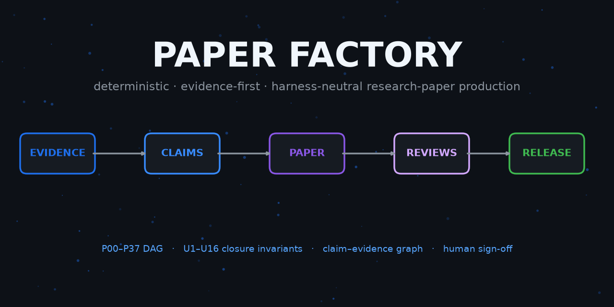
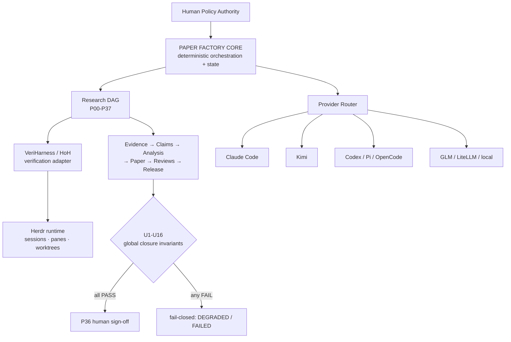

# Paper Factory



**Deterministic, evidence-first orchestration for agentic research-paper production.**

[](https://github.com/SKZL-AI/paper-factory/actions/workflows/ci.yml)
[](https://github.com/SKZL-AI/paper-factory/releases/latest)
[](pyproject.toml)
[](LICENSE)

LLM agents write prose faster than they produce evidence. Paper Factory inverts
that: a deterministic orchestration core drives a **P00–P37 research DAG** and
refuses to close a paper until every scientific claim is bound to concrete,
hash-addressed evidence — independently reviewed, release-gated, and signed off
by a human.

```bash
pip install -e .          # from a clone of this repo
paper-factory doctor      # machine / harness / provider capability inventory
paper-factory complete    # the full pipeline, from a plain shell
```

No interactive coding assistant required. Claude Code, Kimi, Codex, Pi,
OpenCode or LiteLLM-backed workers are **replaceable adapters** — the truth
machinery lives in the core.

## Why

- **Evidence before prose.** Claims enter the paper only through a
  claim–evidence graph with content-addressed artifacts (SHA-256 chains from
  raw data → metrics → LaTeX macros → final PDF).
- **Verification, not vibes.** Work packages are checked by an independent
  verification kernel ([VeriHarness/HoH](https://github.com/SKZL-AI/veriharness),
  `pip install hoh==0.1.0`) through a clean adapter: Paper Factory decides
  *what* scientific work must happen; the kernel verifies *whether* it
  actually did.
- **Fail-closed gates.** Sixteen global closure invariants (U1–U16) audit
  claim support, citation identity, number-to-metric binding, remediation
  integrity, external-edit reconciliation and more. `exit 0` means `CLOSED` —
  and nothing else.
- **arXiv compliance built in.** The venue gate (P32) enforces the current
  arXiv rules: AI-use disclosure with structured `ai_disclosure.yaml`
  (GAIDeT vocabulary), no LLM authorship, chatbot meta-comment scan,
  license irrevocability, English full text, filename/format rules — verified
  against primary sources (see [docs/ARXIV_COMPLIANCE.md](docs/ARXIV_COMPLIANCE.md)).
- **Human authority where it matters.** P36 is an explicit human final
  sign-off. P37 (external submission, e.g. arXiv) is never executed
  automatically.

## Architecture in 60 seconds



Full detail: [docs/ARCHITECTURE.md](docs/ARCHITECTURE.md).

## Hard rules the system enforces

- No empirical final-paper claim without evidence linkage (T0–T4 authority tiers).
- No hand-typed scientific number: raw → metrics → LaTeX macros, hash-bound.
- Final prose only from allowed origins (provenance firewall; unknown backend = deny).
- CRITICAL/MAJOR review findings cannot silently disappear — remediation requires
  a finding-specific post-condition with verification evidence.
- Citations are identity-checked (DOI/arXiv registry match, or verified
  authoritative URLs) — a resolvable DOI pointing at the wrong paper fails.
- The release bundle carries no secrets, no chat logs, no internal reviews,
  and must rebuild independently.

## Command reference

| Command | What it does |
|---|---|
| `doctor` | Machine / harness / provider capability inventory |
| `intake` | Start a fresh run (input-mode detection, artifact registration) |
| `plan` | Show the DAG with current node states |
| `run` | Execute the DAG once |
| `complete` | The full pipeline — `--dry-run` `--resume` `--strict` `--offline` `--target arxiv` |
| `resume` | Continue the latest run (e.g. after a `HUMAN_REQUIRED` gate) |
| `status` | Node states of the latest run |
| `report` | Run report |
| `audit` | Receipts |
| `release` | Release bundle state — currently a fail-closed stub (`NOT_RUN`) |
| `compliance` | Standalone venue-compliance check (`--target arxiv`) |

Interactive frontends (`/complete-paper` skills for agentic CLIs) are thin
wrappers around the same core; see [frontends/](frontends/).

## Verified in operation

Real pilot (a mass-invariance research paper, draft-assisted intake):

- **P21–P36 PASS**, U1–U16 **16/16 PASS**, summary 33 PASS / 4 DEGRADED / 0 FAIL
- Exact artifact chain: manuscript SHA → DOCX SHA → staged Paperpal DOCX SHA →
  receipt SHA → arXiv tarball SHA — **MATCH**
- 245 unique writing-assistant suggestions processed capture-only, 100 %
  dispositioned: 75 applied under semantic guards, 124 rejected with
  evidence, 46 not applicable
- **574 tests passing** (+2 environment skips for Windows-only Word paths)

Reports: [docs/reports/](docs/reports/) · Freeze evidence:
[V1_FREEZE_REPORT.md](V1_FREEZE_REPORT.md)

## Documentation map

| Doc | Read it when |
|---|---|
| [Position paper (PDF)](docs/paper/position-paper.pdf) | You want the concise "what & why" as a citable document |
| [ARCHITECTURE](docs/ARCHITECTURE.md) | You want the system design |
| [OPERATIONS](docs/OPERATIONS.md) | You run it on a real machine |
| [PAPER_WORKFLOW](docs/PAPER_WORKFLOW.md) | You produce an actual paper |
| [PROVIDER_ROUTING](docs/PROVIDER_ROUTING.md) | You wire up model backends |
| [VERIHARNESS_INTEGRATION](docs/VERIHARNESS_INTEGRATION.md) | You touch the verification kernel |
| [SCIENTIFIC_INTEGRITY](docs/SCIENTIFIC_INTEGRITY.md) | You want the evidence rules |
| [PROVENANCE_POLICY](docs/PROVENANCE_POLICY.md) | You want the write-firewall rules |
| [ARXIV_COMPLIANCE](docs/ARXIV_COMPLIANCE.md) | You target arXiv (disclosure, policy gates) |
| [RECOVERY](docs/RECOVERY.md) | Something crashed mid-run |

Optional runtimes: [Herdr](https://github.com/SKZL-AI) (session/pane/worktree
runtime; not on PyPI — the core works without it) and the `hoh` PyPI package
(verification kernel).

## Development

```bash
git clone https://github.com/SKZL-AI/paper-factory && cd paper-factory
python3 -m venv .venv && .venv/bin/pip install -e ".[dev]"
.venv/bin/python -m pytest tests -q     # 574 tests
```

The test suite never spends LLM quota: E2E configs disable HoH nodes, and
network-dependent paths degrade honestly instead of faking results.

## Citation

See [CITATION.cff](CITATION.cff) (GitHub renders APA/BibTeX in the sidebar).

## License

[MIT](LICENSE) — © 2026 Furkan Sakızlı (SKZL-AI)
